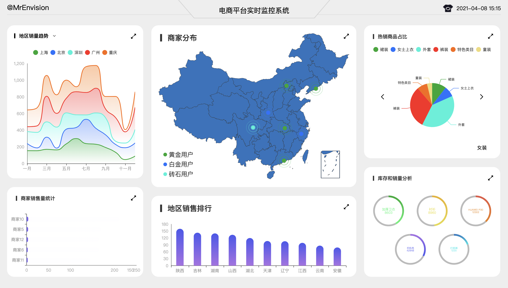
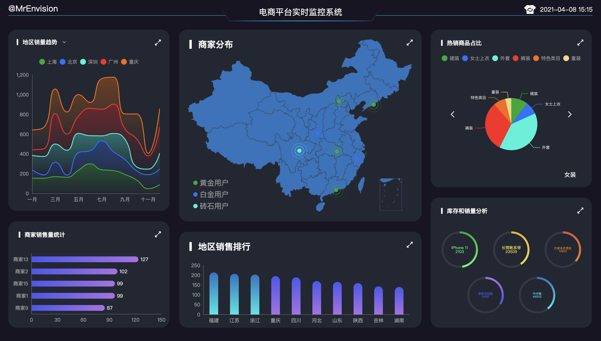
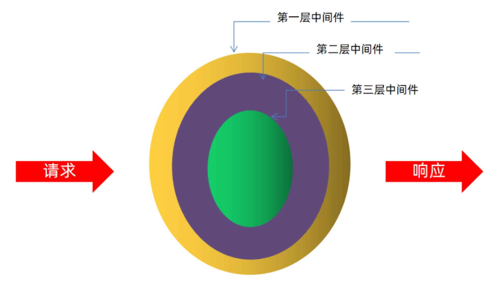
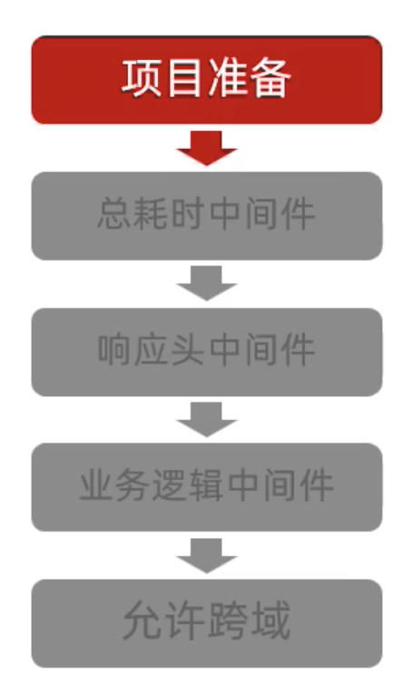

# 数据可视化-电商平台数据监控

> 本项目为电商平台数据可视化简易学习项目，教程详见[电商平台数据可视化实时监控系统学习项目](https://www.bilibili.com/video/BV1bh41197p8)。本项目分为[前端部分](./vision_project)和[后端部分](./koa_serve)，其中前端技术栈为VUE2.0 + Echarts，后端技术栈为Koa。
>
> TIP：更多内容详见[数据可视化专题](https://github.com/MrEnvision/data-vision)！！！


## 预览






## 项目启动

### 1. 后端项目

```shell
cd koa_serve
npm install
node app.js
```

### 2. 前端项目

```shell
cd vision_project
npm install
npm run serve
```


## 后端开发

### 1. KOA2介绍

> KOA2是基于 Node.js 平台的Web服务器框架，通过 `npm i koa` 安装。

特点：

- 支持async/await
- 采用洋葱模型的中间件



洋葱模型中间件的调用顺序为第一层->第二层->第三层->第三层->第二层->第一层，非常类似于冒泡的行为，请求最先到达第一层中 间件，而最后也是第一层中间件对请求再次处理了一下

### 2. KOA2中间件

- Koa2 的实例对象通过 use 方法加入一个中间件
- 一个中间件就是一个函数,这个函数具备两个参数,分别是 ctx 和 next
- 内层中间件能否执行取决于外层中间件的 next 函数是否调用
- 调用 next 函数得到的是 Promise 对象, 如果想得到 Promise 所包装的数据, 可以结合 await 和 async

```js
app.use(async (ctx, next) => { 
  // 刚进入中间件想做的事情 
  await next()
  // 内层所有中间件结束之后想做的事情 
})
```

举例：

```js
app.use(async (ctx, next) => {
  console.log('第一层中间件-1')
  await next()
  console.log('第一层中间件-2')
})

app.use(async(ctx, next) => {
  console.log('第二层中间件-1')
  await next()
  console.log('第二层中间件-2')
})

app.use(async (ctx, next) => {
  console.log('第三层中间件-1')
  await next()
  console.log('第三层中间件-2')
})

// 结果：
// 第一层中间件-1
// 第二层中间件-1
// 第三层中间件-1
// 第三层中间件-2
// 第二层中间件-2
// 第一层中间件-2
// 第一层中间件-1
// 注意上述结果会出现两次，这是因为浏览器会自动请求一次图标啥的，此处无需关注。
```

### 3. KOA2快速上手

步骤：

- 安装 koa2 —— `npm i koa` 
- 编写app.js文件

```js
// // 1.创建koa对象
const Koa = require('koa') // 导入构造方法
const app = new Koa() // 通过构造方法, 创建实例对象

// 2.编写响应函数(中间件)
app.use((ctx, next) => {
  console.log(ctx.request.url)
  ctx.response.body = 'hello world'
})

// 3.绑定端口号 3000
app.listen(3000)
```

> ctx：上下文, 指的是请求所处于的Web容器,可以通过 ctx.request 拿到请求对象, 也可以通过 ctx.response 拿到响应对象
>
> next：内层中间件执行的入口

- 启动服务器 —— `node app.js`
- 在指定端口查看即可 —— `127.0.0.1:3000`

### 4. 后端项目开发

开发目标：三个中间件

- 计算服务器处理请求的总耗时
- 在响应头上加上响应内容的 mime 类型（浏览器更好的来处理由服务器返回的数据）
- 根据URL读取指定目录下的文件内容



**响应中间件开发**

```js
module.exports = async (ctx, next) => {
  // 记录开始的时间
  const start = Date.now()
  // 让内层中间件执行
  await next()
  // 记录结束的时间
  const end = Date.now()
  // 计算响应时间
  const duration = end - start
  // 设置响应头
  ctx.set("X-Response-Time", duration + "ms")
}
```

**响应头中间件**

```js
module.exports = async (ctx, next) => {
  ctx.set("Content-Type", "application/json; charset=utf-8")
  ctx.set("Access-Control-Allow-Origin", "*")
  ctx.set("Access-Control-Allow-Methods", "OPTIONS, GET, PUT, POST, DELETE")
  ctx.response.body = "{'success': true}"
  await next()
}
```

**业务逻辑中间件**

```js
const path = require("path")
const fileUtils = require("../utils/file_utils")

module.exports = async (ctx, next) => {
  // 获取请求路径
  const url = ctx.request.url;
  // 转化为文件路径
  const filePath = "../data" + url.replace("/api", "") + ".json"
  // 转化为绝对路径
  const finalPath = path.join(__dirname, filePath)
  // 获取数据并设置响应体
  try {
    ctx.response.body = await fileUtils.getFileJsonData(finalPath)
  } catch (error) {
    ctx.response.body = JSON.stringify({
      message: "读取文件失败！",
      status: 404
    })
  }
  await next()
}
```

**文件读取**

```js
// 读取文件的工具方法
const fs = require('fs')

module.exports.getFileJsonData = (filePath) => {
  // 根据文件的路径, 读取文件的内容
  return new Promise((resolve, reject) => {
    fs.readFile(filePath, 'utf-8', (error, data) => {
      if(error) {
        // 读取文件失败
        reject(error)
      } else {
        // 读取文件成功
        resolve(data)
      }
    })
  })
}
```

**跨域设置**

```js
// 设置响应头
app.use(async (ctx, next) => {
    ctx.set("Access-Control-Allow-Origin", "*")
    ctx.set("Access-Control-Allow-Methods", "OPTIONS, GET, PUT, POST,
DELETE")
    await next();
})
```


## 前端开发

### 1. 全局挂载Echarts

- 安装echarts `npm i echarts -S`
- 在 `src/main.js` 文件中引入并将其挂载到 Vue 的原型对象上

```js
import * as echarts from 'echarts';

// 将全局echarts对象挂载到Vue的原型对象上 
Vue.prototype.$echarts = echarts
```

- 在别的组件中直接通过`this.$echarts`即可使用

### 2. 组件开发流程

- 组件结构的设计
  - A组件为针对路由路径而显示的文件，其中引入了B组件
  - B组件是真正显示图表的
- 布局结构的设计
  - CSS样式设置
- 基本图表的实现
  - initChart（初始化实例对象）
  - getData（获取数据）
  - updateData（即设置option）

```vue
<template>
  <div class="seller-wrap com-container">
    seller
    <div ref="seller" class="seller-chart com-chart"></div>
  </div>
</template>

<script>
export default {
  name: 'Seller',
  data () {
    return {
      chartInstance: null
    }
  },
  mounted () {
    this.initChart()
    this.getData()
  },
  methods: {
    // 初始化Echarts实例对象
    initChart () {
      this.chartInstance = this.$echarts.init(this.$refs.seller)
    },
    // 获取数据
    async getData () {
      // 前面axios已经挂载在main.js上,即全局,可直接使用this.$http
      const res = await this.$http.get('seller')
      if (res.status === 200) {
        this.updateData(res.data)
      }
    },
    // 更新数据
    updateData (data) {
      const option = {
        // ....
      }
      this.chartInstance.setOption(option)
    }
  }
}
</script>
```

- 动态刷新的实现
  - 根据实际需求采用不同的方法（一般采用定时器）

- 界面样式的调整
- 拆分图表option
  - 初始化配置option
  - 获取数据之后的dataOption
  - 分辨率适配的updatOption
- 分辨率适配
  - 监听窗口大小变化事件

```js
export default {
  mounted () {
    window.addEventListener('resize', this.handlerResize)
  }
}
```

**综上，公共流程如下：**

```vue
<template>
<div class="com-container">
  <div ref="dom" class="com-chart"></div>
  </div>
</template>

<script>
  export default {
    name: 'Demo',
    data () {
      return {
        chartInstance: null,
        data: null
      }
    },
    mounted () {
      this.initChart()
      this.getData()
      window.addEventListener('resize', this.handlerResize)
      this.handlerResize()
    },
    destroyed () {
      window.removeEventListener('resize', this.handlerResize)
    },
    methods: {
      // 初始化
      initChart () {
        this.chartInstance = this.$echarts.init(this.$refs.dom)
        const initOption = {}
        this.chartInstance.setOption(initOption)
      },
      // 获取数据
      async getData () {
        const res = await this.$http.get(...)
        if (res && res.status === 200) {
          this.data = res.data
          this.updateData()
        }
      },
      // 更新数据
      updateData () {
        const dataOption = {}
        this.chartInstance.setOption(dataOption)
      },
      // 分辨率适配
      handlerResize () {
        const adapterOption = {}
        this.chartInstance.setOption(adapterOption)
        this.chartInstance.resize()
      }
    }
  }
</script>

<style lang='less' scoped></style>
```

## WebSocket引入

> 可以保持着浏览器和客户端之间的长连接， 通过 可以实现数据由后端推送到前 端，保证了数据传输的实时性.  **非常重要！！！**

### 1. 基本流程

- 安装 WebSocket 包 —— `npm i ws -S`
- 创建 WebSocket 实例对象
- 监听事件

```js
// 后端
const WebSocket = require("ws") // 创建出WebSocket实例对象
const wss = new WebSocket.Server({ 
  port: 9998 
})
wss.on("connection", client => { 
  console.log("有客户端连接...") 
  client.on("message", msg => {
    console.log("客户端发送数据过来了")
    client.send('hello socket')  // 发送数据给客户端 
  }) 
})
```

```js
// 前端（WebSocket是window对象提供，不需要额外包）
const ws = new WebSocket('ws://localhost:9998') // 服务器地址
ws.onopen = () => {
  console.log('连接服务器成功') 
}
ws.onmessage = msg => {
  console.log('从服务器接收到了数据')
  // msg.data
}
ws.onclose = e => { 
  console.log('服务器关闭了连接') 
} 
```

### 2. 后端koa项目改造

略，详见代码。

### 3. 前端 Vue项目改造

#### 3.1 创建 socket_service.js 文件

基础流程：

- 定义类 SocketService，并设计单例模式
- 创建websocket对象
- 定义连接服务器方法，并在main.js中调用
- 监听事件 - onopen、onmessage、onclose
- 定义存储回调函数对象、注册回调函数方法、删除回调函数方法
- 接受数据处理：onmessage中调用之前注册的回调函数
- 定义发送数据的方法
- 将SocketService对象挂在到Vue原型对象上，方便在组建中直接使用相关方法

优化机制：

- 发送数据需要判断是否连接，如果未连接则要进行轮询

```js
// 单例模式
export default class SocketService {
  static instance = null

  static get Instance () {
    if (!this.instance) {
      this.instance = new SocketService()
    }
    return this.instance
  }

  // 和服务端连接的socket对象
  ws = null

  // 存储回调函数
  callBackMapping = {}

  // 标识是否连接成功
  connected = false

  // 记录重试的次数
  sendRetryCount = 0

  // 重新连接尝试的次数
  connectRetryCount = 0

  // 定义连接服务器的方法
  connect () {
    if (!window.WebSocket) {
      return console.log('您的浏览器不支持WebSocket!')
    }
    this.ws = new WebSocket('ws://localhost:9999')

    // 连接成功的事件
    this.ws.onopen = () => {
      console.log('连接服务端成功了')
      this.connected = true
      // 重置重新连接的次数
      this.connectRetryCount = 0
    }

    // 连接服务端失败 或 当连接成功之后服务器关闭的情况
    this.ws.onclose = () => {
      console.log('连接服务端失败')
      this.connected = false
      this.connectRetryCount++
      setTimeout(() => {
        this.connect()
      }, 500 * this.connectRetryCount)
    }

    // 得到服务端发送过来的数据
    this.ws.onmessage = msg => {
      console.log('从服务端获取到了数据')
      const recvData = JSON.parse(msg.data)
      const socketType = recvData.socketType
      // 判断回调函数是否注册
      if (this.callBackMapping[socketType]) {
        const action = recvData.action
        if (action === 'getData') {
          const realData = JSON.parse(recvData.data)
          this.callBackMapping[socketType].call(this, realData)
        } else if (action === 'fullScreen') {
          this.callBackMapping[socketType].call(this, recvData)
        } else if (action === 'themeChange') {
          this.callBackMapping[socketType].call(this, recvData)
        }
      }
    }
  }

  // 回调函数的注册
  registerCallBack (socketType, callBack) {
    this.callBackMapping[socketType] = callBack
  }

  // 取消某一个回调函数
  unRegisterCallBack (socketType) {
    this.callBackMapping[socketType] = null
  }

  // 发送数据的方法
  send (data) {
    // 判断此时此刻有没有连接成功
    if (this.connected) {
      this.sendRetryCount = 0
      this.ws.send(JSON.stringify(data))
    } else {
      this.sendRetryCount++
      setTimeout(() => {
        this.send(data)
      }, this.sendRetryCount * 500)
    }
  }
}
```

#### 3.2 组件改造

- created - 注册回调函数
- destoryed - 取消回调函数
- 原本获取数据地方改为websocket发送数据


------

如果发现本项目有错误，欢迎提交 issues 指正，也可联系邮箱[EnvisionShen@gmail.com](mailto:EnvisionShen@gmail.com)。

