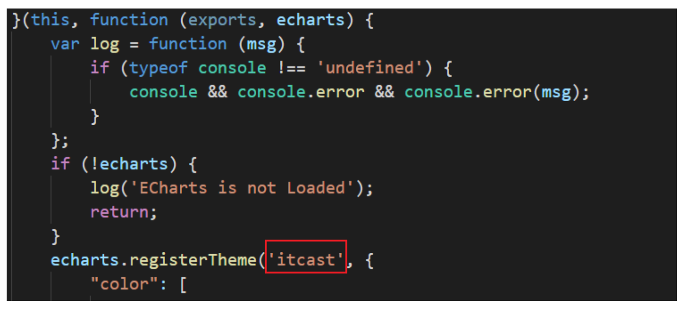

# Echarts学习

## 1. Echarts简介

ECharts是百度公司开源的一个使用 JavaScript 实现的开源可视化库，兼容性强，底层依赖矢量图形 库 ZRender ，提供直观，交互丰富，可高度个性化定制的数据可视化图表。

Echarts - [官方网址](https://echarts.apache.org/zh/index.html) [说明文档](https://echarts.apache.org/zh/api.html) [参考示例](https://echarts.apache.org/examples/zh/index.html) 

## 2. Echarts快速上手

主要分为5个步骤：

- 步骤1:引入 echarts.js 文件
- 步骤2:准备一个呈现图表的盒子
- 步骤3:初始化 echarts 实例对象
- 步骤4:准备配置项（**关键！！！**）
- 步骤5:将配置项设置给 echarts 实例对象

>对于不同的图表，除了配置项会发生改变之外，其他的代码都是固定不变的。

```html
<!DOCTYPE html>
<html lang="en">
<head>
  <meta charset="UTF-8">
  <title>Echarts</title>
  <!-- 步骤1：引入echarts.js文件 -->
  <script src="echarts.min.js"></script>
</head>
<body>
<!-- 步骤2：准备一个呈现图表的盒子 -->
<div id="chart" style="width: 600px; height: 400px;"></div>
<script>
  // 步骤3：初始化echarts实例对象
  const mCharts = echarts.init(document.getElementById("chart"));
  // 步骤4：准备配置项
  const option = {
    // 直角坐标系 中的 x 轴, 如果 type 属性的值为 category ,那么需要配置 data 数据, 代表在 x 轴呈现
    xAxis: {
      type: 'category',
      data: ['小明', '小红', '小王']
    },
    // 直角坐标系 中的 y 轴, 如果 type 属性配置为 value , 那么无需配置 data , 此时 y 轴会自动去 series 下找数据进行图表的绘制
    yAxis: {
      type: 'value'
    },
    // 系列列表, 每个系列通过 type 决定自己的图表类型, data 来设置每个系列的数据
    series: [
      {
        name: '语文',
        type: 'bar',
        data: [70, 92, 87]
      }
    ]
  };
  // 步骤5：将配置项设置给echarts实例对象
  mCharts.setOption(option);
</script>
</body>
</html>
```

## 3. Echarts常用图表

### 3.1 柱状图

> 柱状图描述的是分类数据，呈现的是每一个分类中『有多少?』, 图表所表达出来的含义在于不同类别数据的排名\对比情况。

```js
// 配置项 （如果柱状图要横过来则将xAxis和yAxis反过来就行了）
const option = {
  xAxis: {
    type: 'category',
    data: ['小明', '小红', '小王']
  },
  yAxis: {
    type: 'value'
  },
  series: [
    {
      name: '语文',
      type: 'bar', // 表示设置为柱状图
      data: [70, 92, 87],
      // 最大值&最小值-点
      markPoint: {
        data: [
          {type: 'max', name: '最大值'},
          {type: 'min', name: '最小值'}
        ]
      },
      // 平均值-线
      markLine: {
        data: [
          {type: 'average', name: '平均值'}
        ]
      },
      // 数据显示
      label: {
        show: true, // 是否可见
        rotate: 60 // 旋转角度
      },
      // 柱的宽度
      barWidth: '30%'
    },
  ]
};
```

注意：坐标轴 xAxis 或者 yAxis 中的配置, type 的值主要有两种: category 和 value , 如果 type 属性的值为 category ,那么需要配置 data 数据, 代表在 x 轴的呈现. 如果 type 属性配置为 value , 那么无需配置 data , 此时 y 轴会自动去 series 下找数据进行图表的绘制。

### 3.2 折线图

> 折线图更多的使用来呈现数据随时间的『变化趋势』

```js
const option = {
  xAxis: {
    type: 'category',
    data: ['1月', '2月', '3月', '4月', '5月', '6月', '7月', '8月', '9月'],
    boundaryGap: false // 紧挨边缘, 让起点从 x 轴的0坐标开始
  },
  yAxis: {
    type: 'value',
    scale: true // 缩放, 脱离0值比例, 常用于每一组数据之间相差较少, 且都比0大很多
  },
  series: [
    {
      type: 'line',
      data: [3000, 2800, 900, 1000, 800, 700, 1400, 1300, 900],
      // 最大值&最小值-点
      markPoint: {
        data: [
          {type: 'max', name: '最大值'},
          {type: 'min', name: '最小值'}
        ]
      },
      // 平均值-线
      markLine: {
        data: [
          {type: 'average', name: '平均值'}
        ]
      },
      // 标注区间
      markArea: {
        data: [
          [{xAxis: '1月'}, {xAxis: '2月'}],
          [{xAxis: '7月'}, {xAxis: '8月'}]
        ]
      },
      // 平滑线条
      smooth: true,
      // 线条样式
      lineStyle: {
        color: 'green',
        type: 'dashed' // 可选值还有 dotted solid
      },
      // 填充风格
      areaStyle: {
        color: 'pink'
      }
    }
  ]
};
```

注意：还有一种堆叠图，即同个类目轴上系列配置相同的 stack 值后，后一个系列的值会在前一个系列的值上相加。

### 3.3 散点图

> 散点图可以帮助我们推断出不同维度数据之间的相关性, 散点图也经常用在地图的标注上

```js
// 气泡图
const option = {
  xAxis: {
    type: 'value',
    scale: true
  },
  yAxis: {
    type: 'value',
    scale: true
  },
  series: [
    {
      type: 'scatter', 
      data: [[161.2, 51.6], ... ],
      // 控制散点的大小, 也支持直接使用回调函数
      // symbolSize: 25,
      symbolSize: function (arg) {
        const bmi = arg[1] / ((arg[0] / 100) * (arg[0] / 100))
        return bmi > 28 ? 20 : 5
      },
      // 控制散点的颜色, 也支持直接使用回调函数
      // itemStyle: { color: 'green' },
      itemStyle: function (arg) {
        const bmi = arg[1] / ((arg[0] / 100) * (arg[0] / 100))
        return bmi > 28 ? "red" : "green"
      }
    }
  ]
};
```

```js
// 涟漪动画
const option = {
  xAxis: {
    type: 'value',
    scale: true
  },
  yAxis: {
    type: 'value',
    scale: true
  },
  series: [
    {
      type: 'effectScatter', // 设为'effectScatter'能够产生涟漪动画的效果
      data: [[161.2, 51.6], ...],
      // 配置涟漪动画的大小, 需要将 type 设置为 effectScatter
      rippleEffect: {
        scale: 3
      },
      // showEffectOn 可以控制涟漪动画在什么时候产生, 可选值: render 和 emphasis
      // render 代表界面渲染完成就开始涟漪动画
      // emphasis 代表鼠标移过某个散点的时候, 该散点开始涟漪动画
      showEffectOn: 'emphasis'
    }
  ]
};
```

### 3.4 饼图

> 饼图可以很好地帮助用户快速了解不同分类的数据的占比情况

```js
const option = {
  series: [
    {
      type: "pie",
      data: [
        {value: 11231, name: "淘宝",},
        {value: 22673, name: "京东"},
        {value: 6123, name: "唯品会"}
      ],
      // 显示数值
      label: {
        show: true, // 显示文字
        formatter: function (arg) { // 格式化文字
          return arg.data.name + '平台' + arg.data.value + '元'
        }
      },
      // 南丁格尔图(每个扇形的半径随着数据的大小而不同, 数值越大, 扇形半径越大)
      roseType: 'radius',
      // 选中模式，表示是否支持多选，支持布尔值和字符串
      selectedMode: 'multiple',
      // 选中扇区的偏移距离
      selectedOffset: 30,
      // radius 单个值指定外半径值，数组则分别为内\外半径
      // radius 取值可以是数字，也可以是字符串形式的百分比
      radius: 40,
      radius: ["20%", "40%"]
    }
  ]
};
```

### 3.5 地图

> 地图主要可以帮助我们从宏观的角度快速看出不同地理位置上数据的差异，常用的地图数据详见：[地图数据文件](../map_data)。

```html
<!DOCTYPE html>
<html lang="en">
  <head>
    <meta charset="UTF-8">
    <title>Echarts</title>
    <!-- 步骤1：引入echarts.js文件 -->
    <script src="echarts.min.js"></script>
    <script src="jquery.min.js"></script>
  </head>
  <body>
    <!-- 步骤2：准备一个呈现图表的盒子 -->
    <div id="chart" style="width: 600px; height: 400px;"></div>
    <script>
      // 步骤3：初始化echarts实例对象
      const mCharts = echarts.init(document.getElementById("chart"));
      // 步骤4：获取地图数据 - 这里采用ajax的方式获取地图json文件
      $.get("json/china.json", (chinaJson) => {
        // 步骤5： echarts 全局对象注册地图的 json 数据
        echarts.registerMap('chinaMap', chinaJson)
        // 步骤6：准备配置项
        const option = {
          geo: {
            type: 'map',// map是一个固定的值
            map: 'chinaMap',//chinaMap需要和registerMap中的第一个参数保持一致
            roam: true, // 运行使用鼠标进行拖动和缩放
            label: { show: true }, // 名称显示
            zoom: 0.8, // 地图的缩放比例, 大于1代表放大, 小于1代表缩小
            center: [87.617733, 43.792818] // 当前视角的中心点，用经纬度表示
          }
        };
        // 步骤7：将配置项设置给echarts实例对象
        mCharts.setOption(option);
      })
    </script>
  </body>
</html>
```

```js
// 不同城市颜色不同
const option = {
  geo: {
    type: 'map',// map是一个固定的值
    map: 'chinaMap',//chinaMap需要和registerMap中的第一个参数保持一致
    roam: true, // 运行使用鼠标进行拖动和缩放
    label: {show: true}, // 名称显示
  },
  series: [
    {
      // 将 series 下的数据和 geo 关联起来
      type: "map",
      geoIndex: 0,
      // series 的数据
      data: [{name: '北京', value: 39.92}, {name: '天津', value: 39.13}, ...]
    }
  ],
  // 视觉映射组件
  visualMap: {
    min: 0, // 最小值
    max: 300, // 最大值 inRange: {
    color: ['white', 'red'], // 颜色的范围 },
    calculable: true // 是否显示拖拽用的手柄(手柄能拖拽调整选中范围)
  }
};
```

```js
// 地图和散点图结合
const option = {
  geo: {
    type: 'map',
    map: 'chinaMap',
    roam: true,
    label: {show: true},
  },
  series: [
    {
      type: "map",
      geoIndex: 0,
      data: [{name: '北京', value: 39.92}, {name: '天津', value: 39.13},...]
    },
    {
      // 散点数据
      data: [{
        value: [117.283042, 31.86119] // 散点的坐标, 使用的是经纬度
      }],
      type: 'effectScatter',
      coordinateSystem: 'geo', // 散点图使用地图坐标系统
      rippleEffect: {
        scale: 10
      }
    }
  ]
};
```

### 3.6 雷达图

>雷达图可以用来分析多个维度的数据与标准数据的对比情况

```js
const option = {
  radar: {
    // 每个维度的最大值
    indicator: [
      {name: '易用性', max: 100},
      {name: '功能', max: 100},
      {name: '拍照', max: 100},
      {name: '跑分', max: 100},
      {name: '续航', max: 100}
    ],
    // 雷达图绘制类型，支持 'polygon' 和 'circle'
    shape: 'polygon'
  },
  series: [
    {
      type: 'radar',
      // 显示数值
      label: {
        show: true
      },
      // 区域面积
      areaStyle: {},
      data: [
        {name: '华为手机1', value: [80, 90, 80, 82, 90]},
        {name: '中兴手机1', value: [70, 82, 75, 70, 78]}
      ]
    }
  ]
};
```

### 3.7 仪表盘图

>仪表盘可以更直观的表现出某个指标的进度或实际情况

```js
const option = {
  series: [
    {
      type: 'gauge',
      data: [
        {
          value: 97,
          // 多个指针颜色的差异
          itemStyle: {
            color: 'pink'
          }
        },
        {value: 12}
      ],
      // 数值范围
      max: 100,
      min: 10
    }
  ]
};
```

### 3.8 直角坐标系配置

> 直角坐标系的图表指的是带有x轴和y轴的图表, 常见的直角坐标系的图表有: 柱状图 折线图 散点图.

#### 3.8.1 网格 grid

```js
const option = {
  grid: {
    show: true, // 显示grid
    borderWidth: 10, // grid的边框宽度
    borderColor: 'red', // grid的边框颜色
    left: 100, // grid的位置
    top: 100,
    width: 300, // grid的大小
    height: 150
  }
}
```

#### 3.8.2  坐标轴 axis

```js
const option = {
  xAxis: {
    type: 'category', // 坐标轴类型 type
    data: xDataArr,
    position: 'top' // 坐标轴位置
  },
  yAxis: {
    type: 'value',
    position: 'right'
  }
}
```

#### 3.8.3 区域缩放 dataZoom

```js
const option = {
  dataZoom: [
    {
      type: 'slider', // 区域缩放类型 slider(滑块)\inside(依靠鼠标滚轮或者双指缩放)
      xAxisIndex: 0 // 设置缩放组件控制的是哪个 x 轴, 一般写0即可
    },
    {
      type: 'slider',
      yAxisIndex: 0,
      start: 0, // 数据窗口范围的起始百分比
      end: 80 // 数据窗口范围的结束百分比
    } 
  ]
}
```

### 3.9 通用配置

> 使用 ECharts 绘制出来的图表, 都天生就自带一些功能, 这些功能是每一个图表都具备的, 我们可以通过 配置, 对这些功能进行设置.

#### 3.9.1 标题 title

``` js
const option = {
  title: {
    text: "成绩", // 标题文字
    textStyle: {
      color: 'red' // 文字颜色 
    },
    borderWidth: 5, // 标题边框
    borderColor: 'green', // 标题边框颜色
    borderRadius: 5, // 标题边框圆角 
    left: 20, // 标题的位置
    top: 20 // 标题的位置
  }
}
```

#### 3.9.2 提示 tooltip

> tooltip 指的是当鼠标移入到图表或者点击图表时, 展示出的提示框.

```js
const option = {
  tooltip: {
    trigger: 'item', // 触发类型 item\axis
    triggerOn: 'click', // 触发时机 mouseOver\click
    formatter: '{b}:{c}' // 格式化显示，详见官方文档
    formatter: function (arg) { // 格式化显示也可以使用回调函数
  		return arg.name + ':' + arg.data
		}
	}
};
```

#### 3.9.3 工具按钮 toolbox

>toolbox 是 ECharts 提供的工具栏, 内置有导出图片、数据视图、重置、数据区域缩放和动态类型切换五个工具.

```js
const option = {
  toolbox: {
    feature: {
      saveAsImage: {}, // 将图表保存为图片
      dataView: {}, // 是否显示出原始数据
      restore: {}, // 还原图表
      dataZoom: {}, // 数据缩放
      magicType: { // 将图表在不同类型之间切换,图表的转换需要数据的支持
        type: ['bar', 'line']
      }
    }
  }
}
```

#### 3.9.4 图例 legend

> legend 是图例,用于筛选类别,需要和 series 配合使用, 即 legend 中的 data 的值需要和 series 数组中某组数据的 name 值一致.

```js
const option = {
  legend: {
    data: ['语文', '数学'] 
  },
  xAxis: {
    type: 'category',
    data: ['张三', '李四', '王五', '闰土', '小明', '茅台', '二妞', '大强']
  }, 
  yAxis: {
    type: 'value'
  },
  series: [
    {
      name: '语文',
      type: 'bar',
      data: [88, 92, 63, 77, 94, 80, 72, 86]
    }, {
      name: '数学',
      type: 'bar',
      data: [93, 60, 61, 82, 95, 70, 71, 86]
    }
  ]
}
```

## 4. Echarts高级设置

### 4.1 显示相关

#### 4.1.1 主题

> ECharts中默认内置了两套主题:light dark，但是我们也可以在[自定义主题页面](https://www.echartsjs.com/theme-builder/)中自定义主题来引入。

```js
// 在初始化对象方法 init 中指明主题
const mCharts = echarts.init(dom, "主题名字");
```

注意：自定义主题设置完后会导出一份js文件，自定义主题的名字可详见js代码。



#### 4.1.2 调色盘

> 它是一组颜色，图形、系列会自动从其中选择颜色, 不断的循环从头取到尾, 再从头取到尾, 如此往复。

- 主题调色盘——在主题文件中

```js
echarts.registerTheme('itcast', {
    "color": [
        "#893448",
        "#d95850",
        "#eb8146",
        "#ffb248",
        "#f2d643",
        "#ebdba4"
    ],
    "backgroundColor": "rgba(242,234,191,0.15)",
    ......
})
```

- 全局调色盘——在option中

```js
const option = {
  // 全局调色盘
    color: ['red', 'green', 'blue'],
}
```

- 局部调色盘——在series中

```js
const option = {
  series: [
    {
      // 局部调色盘
      color: ['pink', 'yellow', 'black']
    } ]
}
```

注意，三者的优先级是局部>全局>主题，即就近原则。

#### 4.1.3 渐变颜色

- 线性渐变

> 线性渐变的类型为 linear, 通过 x, y, x2, y2 即可配置线性的方向

```js
const option = {
  series: [
    {
      itemStyle: {
        color: {
          type: 'linear',
          // 表示起始点为(0,1),终点为(0,0)
          x: 0,
          y: 0,
          x2: 1,
          y2: 0,
          colorStops: [{
            offset: 0, color: 'red' // 0% 处的颜色
          }, {
            offset: 1, color: 'blue' // 100% 处的颜色
          }],
          globalColor: false // 缺省为 false
        }
      }
    }
  ]
}
```

- 径向渐变

> 线性渐变的类型为 radial , 通过 x , y , r 即可配置径向的方向

```js
const option = {
  series: [
    {
      itemStyle: {
        color: {
          type: 'radial',
          // 表示圆心(x,y)和半径r
          x: 0.5,
          y: 0.5,
          r: 0.5,
          colorStops: [{
            offset: 0, color: 'red' // 0% 处的颜色
          }, {
            offset: 1, color: 'blue' // 100% 处的颜色
          }],
          globalColor: false // 缺省为 false
        }
      }
    }
  ]
}
```

#### 4.1.4 样式

##### 4.1.4.1 直接样式

- itemStyle
- textStyle
- lineStyle
- areaStyle
- label

```js
const option = {
  series: [
    {
      data: [
        {
          // 控制这一数据区域的样式
          itemStyle: { color: "yellow" }
        }
      ]
    }
  ],
  title: {
    // 控制标题的文字样式
    textStyle: { color: "red" }
  },
  // 控制图中文字样式
  label: { color: 'green' }
}
```

##### 4.1.4.2 高亮样式

> 图表中, 其实有很多元素都是有两种状态的, 一种是默认状态, 另外一种就是鼠标滑过或者点击形成的高亮状态，主要通过 emphasis 中包裹原先的样式即可。

```js
const option = {
  series: [
    {
      data: [
        {
           // emphasis包裹样式
           emphasis: {
             itemStyle: { color: "yellow" }
           }
        }
      ]
    }
  ]
}
```

#### 4.1.5 自适应显示

> 当浏览器大小发生变化的时候，图表也能随之适配变化

- 步骤1: 监听窗口大小变化事件
- 步骤2: 在事件处理函数中调用 ECharts 实例对象的 resize 即可

```js
const mCharts = echarts.init(dom);
mCharts.setOption(option);
// 监听window大小变化的事件
window.onresize = () => {
  // 调用echarts示例对象的resize方法
  mCharts.resize()
}
```

### 4.2 动画使用

#### 4.2.1 加载动画

> ECharts 已经内置好了加载数据的动画, 我们只需要在合适的时机显示或者隐藏即可

```js
// 显示加载动画 - 一般, 我们会在获取图表数据之前, 显示加载动画
mCharts.showLoading()

// 隐藏加载动画 - 一般, 我们会在获取图表数据之后, 隐藏加载动画, 显示图表
mCharts.hideLoading()
```

#### 4.2.2 增量动画

> 所有数据的更新都通过 setOption 实现, 我们不用考虑数据到底产生了那些变化, ECharts 会找到两组数据之间的差异然后通过合适的动画去表现数据的变化。

举例略，只要在此之前使用`mCharts.setOption(newOption);`就会自动实现。

注意，新旧option不是相互覆盖的关系，而是互相整合的关系，并不存在替换的情况，所以重复一致的样式就不要写多遍，只需要考虑变化的部分就可以了。

#### 4.2.3 常用动画配置

```js
const option = {
  // 开启动画, 默认为true
  animation: true,
  
  // 动画时长 - 还指出回调函数
  animationDuration: 5000,
  animationDuration: (arg) => {
    // 常用于利用arg实现不同元素实现不同动画
    return 2000 * arg
  }
  
  // 缓动动画 - 还有好多, 详见配置项文档
  animationEasing : 'bounceOut',
  
  // 动画阈值 - 单种形式的元素数量大于这个阈值时会关闭动画
  animationThreshold: 8
}
```

### 4.3 交互API

#### 4.3.1 全局echarts对象

> 全局 echarts 对象是引入 echarts.js 文件之后就可以直接使用的

```js
// 初始化ECharts实例对象
echarts.init

// 注册主题
echarts.registerTheme

// 注册地图数据 - 详见3.5节
echarts.registerMap

// 实现多图关联，传入联动目标为EChart实例，支持数组 - 可以查看note中的例子
echarts.connect
```

#### 4.3.2 echarts实例对象

> echarts 实例对象是通过 echarts.init 方法调用之后得到的

```js
// 设置或修改图表实例的配置项以及数据
echartsInstance.setOption

// 重新计算和绘制图表，一般和window对象的resize事件结合使用
echartsInstance.resize

// 绑定或者解绑事件处理函数
echartsInstance.on('click',  (arg) => {
  console.log(arg)
})
echartsInstance.off('click')

// 主动触发某些行为, 使用代码模拟用户的行为
echartsInstance.dispatchAction({
  // 触发高亮的行为
  type: "highlight",
  seriesIndex: 0,
  dataIndex: 1
})
echartsInstance.dispatchAction({
  // 触发显示提示框的行为
  type: "showTip",
  seriesIndex: 0,
  dataIndex: 3
})

// 清空当前实例，会移除实例中所有的组件和图表，清空之后可以再次 setOption
echartsInstance.clear

// 销毁实例，销毁后实例无法再被使用，即无法再次 setOption
echartsInstance.dispose

```


------

如果发现本项目有错误，欢迎提交 issues 指正。